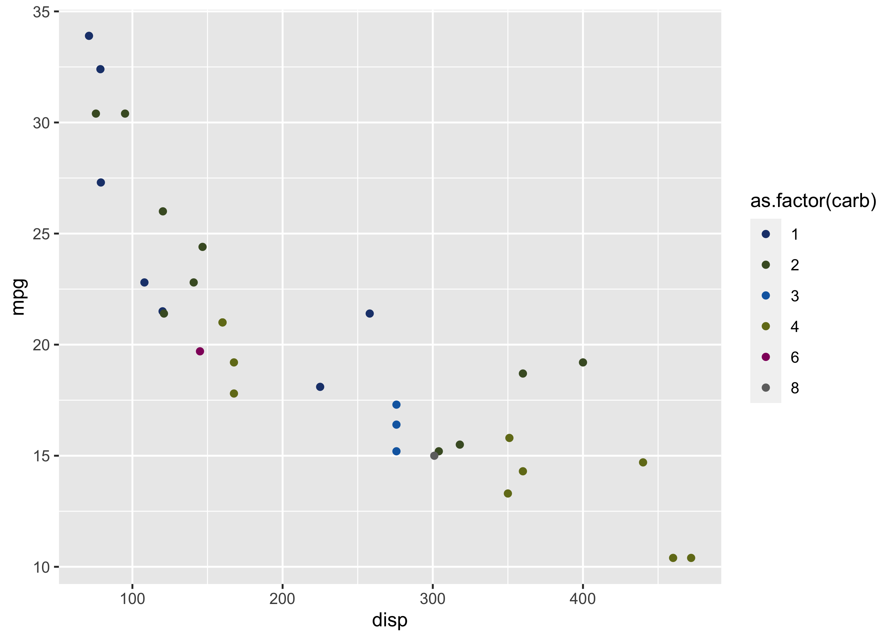
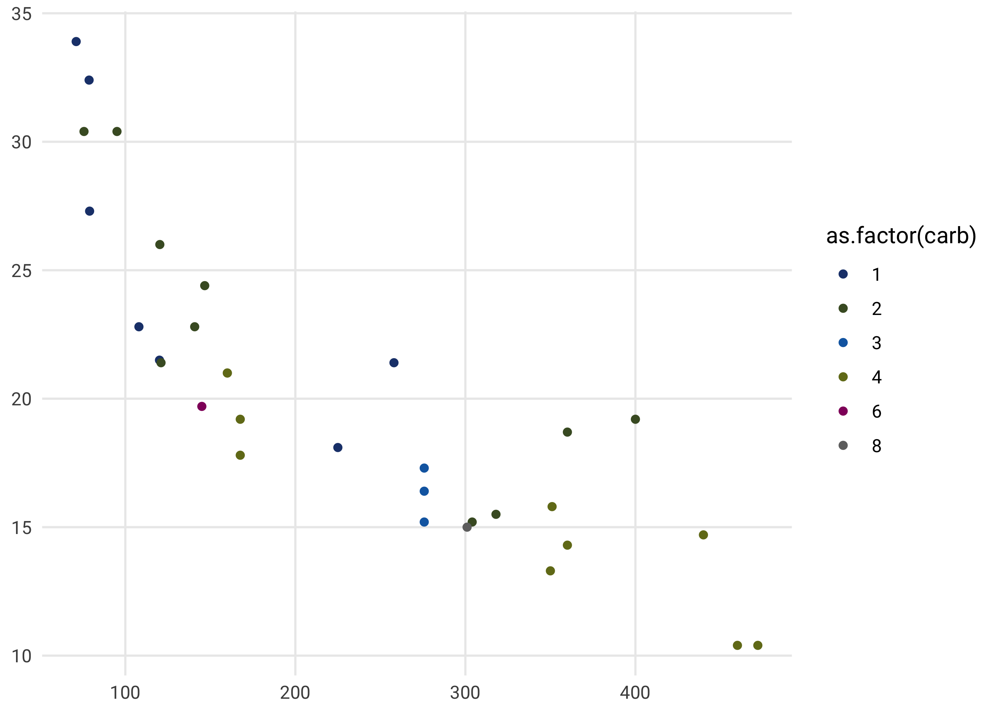

<!-- README.md is generated from README.Rmd. Please edit that file -->

# sep

The goal of `sep` is to help collaborators and interested users to
create graphics as used in the Swiss Environmental Panel Reports.

## Installation

You can install a development version of `sep` from
[GitHub](https://github.com/) with:

``` r
# install.packages("devtools")
devtools::install_github("bonschorno/sep")
```

``` r
library(sep)
library(tidyverse)
#> ── Attaching packages ─────────────────────────────────────── tidyverse 1.3.0 ──
#> ✓ ggplot2 3.3.2     ✓ purrr   0.3.4
#> ✓ tibble  3.0.4     ✓ dplyr   1.0.2
#> ✓ tidyr   1.1.2     ✓ stringr 1.4.0
#> ✓ readr   1.3.1     ✓ forcats 0.5.0
#> ── Conflicts ────────────────────────────────────────── tidyverse_conflicts() ──
#> x dplyr::filter() masks stats::filter()
#> x dplyr::lag()    masks stats::lag()
```

## A quick overview

Probably the most useful function is `sep_palette` for the time being.
It is is a non-exhaustive selection of official color palettes as listed
on the ETH Zurich website. This makes adding the official ETH colors to
the plots very easy with the various `scale_*_manual` functions.

``` r
sep_palette("Darkblues")
#> [1] "#385C9B" "#748DB9" "#A0B1D0" "#CDD6E6" "#E6EbF3"
#> attr(,"class")
#> [1] "palette"
#> attr(,"name")
#> [1] "Darkblues"
```

``` r
sep_palette("Pinks", n = 4)
#> [1] "#A73788" "#BD69A5" "#D39BC3" "#E9CDE1"
#> attr(,"class")
#> [1] "palette"
#> attr(,"name")
#> [1] "Pinks"
```

``` r
ggplot(mtcars, aes(x = disp, y = mpg, color = as.factor(carb))) +
  geom_point() +
  scale_color_manual(values = sep_palette("Standard"))
```



To make the plots not only more visually appealing, but also to
standardize them across the various reports, `theme_sep` was designed.
It can either be applied locally or set as default at the beginning of
the script.

``` r
ggplot(mtcars, aes(x = disp, y = mpg, color = as.factor(carb))) +
  geom_point() +
  scale_color_manual(values = sep_palette("Standard")) +
  theme_sep()
```



``` r

#set as default theme
theme_set(theme_sep())
```

Two other functions are currently still very basic, but will be improved
soon. One is `crosstable`, which creates simple crosstables of n
(numeric) variables and `simple_barplot` to make creating bar plots very
easy.

``` r
crosstable(vars = c("gear", "am"), df = mtcars)
#>     am
#> gear    1
#>    4 0.62
#>    5 0.38
```

``` r
simple_barplot(df = mtcars, var = gear, title = "Gears", width = 0.3) 
```


