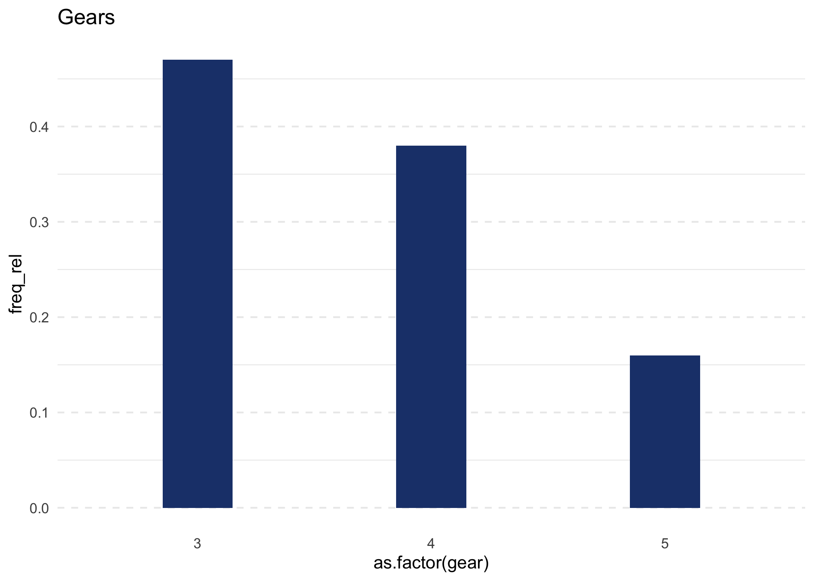

<!-- README.md is generated from README.Rmd. Please edit that file -->

# sep

The goal of `sep` is to help collaborators and interested users to
create graphics as used in the Swiss Environmental Panel Reports.

## Installation

You can install a development version of `sep` from
[GitHub](https://github.com/) with:

``` r
# install.packages("devtools")
devtools::install_github("bonschorno/sep")
```

``` r
library(sep)
library(tidyverse)
#> ── Attaching packages ─────────────────────────────────────── tidyverse 1.3.0 ──
#> ✓ ggplot2 3.3.2     ✓ purrr   0.3.4
#> ✓ tibble  3.0.4     ✓ dplyr   1.0.2
#> ✓ tidyr   1.1.2     ✓ stringr 1.4.0
#> ✓ readr   1.3.1     ✓ forcats 0.5.0
#> ── Conflicts ────────────────────────────────────────── tidyverse_conflicts() ──
#> x dplyr::filter() masks stats::filter()
#> x dplyr::lag()    masks stats::lag()
```

## Example

First, replace the default theme of ggplot2 with `theme_sep.`

``` r
#theme_set(theme_sep())
```

``` r
#create a simple barplot with manually adjusted with of bars
simple_barplot(df = mtcars, var = gear, title = "Gears", width = 0.3) 
```



``` r
# creating a simple crosstable

crosstable(vars = c("gear", "am"), df = mtcars)
#>     am
#> gear    1
#>    4 0.62
#>    5 0.38
```
